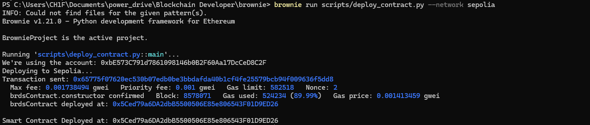

1. Create an infura account - collect the API/Project Id - store in .env file in root directory
2. Create a metamask account collect the specific account private key - store in .env file in root directory as per indicated

   \*via the account details collect the PRIVATE KEY of your account (most preferably use testnet i.e sepolia ethereum), copy and paste here as PRIVATE_KEY_METAMASK

   \*if your account is running low on sepolia ethereum use the link provided in sepolia_faucet.txt

3. Create your smart contract, add to folder contracts/

   \*Most prefarably name the contract main function/object same name as your contract file name e.g smartcontract.sol then proceed:
   contract smartcontract{

    <!-- Your smart contract logic here -->

   }

4. Ensure brownie is installed on your device
   Follow link https://eth-brownie.readthedocs.io/en/stable/install.html to install (if needed!)

5. Change directory to the root folder i.e. /Deploy a Contract Using Brownie and run deploy i.e.

   > cd "Deploy a Contract Using Brownie"
   > 
   > brownie run scripts/deploy_contract.py

   

   Successful deployed, you will see changes in build/deployemnt/<chain Id i.e. 11155111>/<contract_address i.e. 0xdsd>

Or

6. (if neccessary)- Initialise a new brownie project via brownie init

   > cd root_brownie_project_folder
   > 
   > brownie init

   from here follow the necessary procedures i.e up step 1 -
   This means you will need to create
   a. root/.env
   b. brownie-config.yaml
   c. smart contarct : contarcts/yourcontract_name.sol
